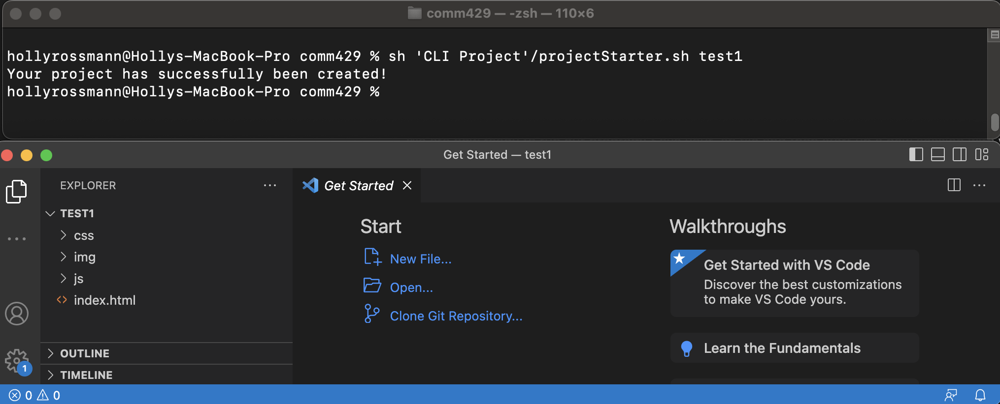
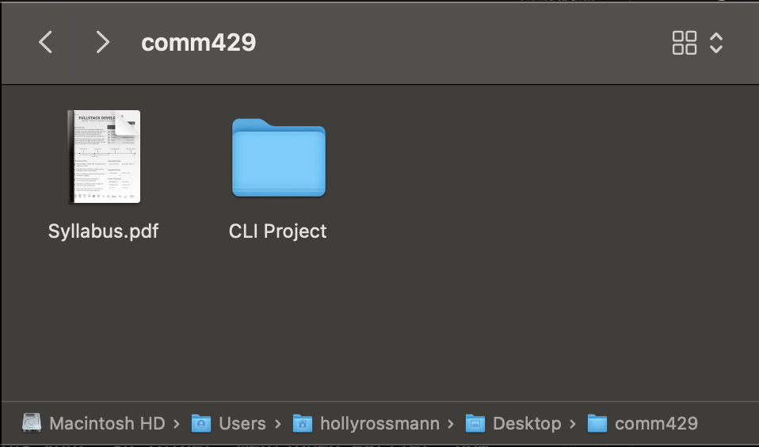
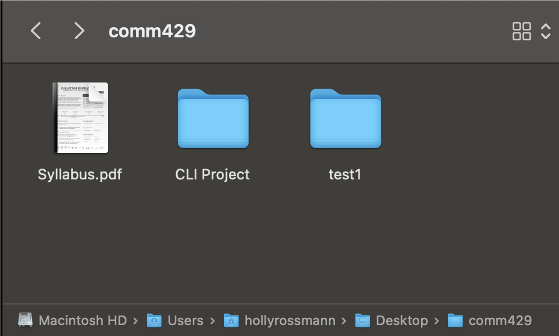

# Blog Post 1: How to Create Bash Script for Project Templates
### By: Holly Rossmann
<br>
This blog post will act as a tutorial for Mac users who are interested in automating the process of setting up a new repository with commonly used files. Additionally, this project will be opened in VSCode upon the script running, allowing the user the ease to begin working, or to initialize a github repository from the VSCode application.

The focus of this blog post will be to walk you through creating a Bash Script (.sh) file that will automatically set up a new project for you with boilerplate html, css, and js files. 

*(This was done on a Mac - the success of some steps below may vary for users of a different OS.)*

<br> 

> ## Prerequisites
> * Access to a Terminal (Default Mac Terminal)
> * Access to a Text Editor (VSCode)

<br>

## Step 1: File Structure Decisions
The first thing that must be determined is what your ideal folders and files would be. This is meant to make your life easier by automating a task that you find yourself repeating a lot. What typical folders does your project consist of? What files do you find yourself always needing? While I will be moving forward with a file structure that I find helpful for myself, feel free to deviate and change this step for what works best for you. Write down a list of your planned folders and files.

You also should think about where you want this project and stored. Since this is meant to be for conviencence, you should ideally have the executable .sh file be somewhere within easy access. Since this automation will be most helpful for me regarding my COMM429 course, I decided to store my file on the path Desktop > COMM429. 

Once you have a draft of your file structure and a plan for where the .sh file to be stored, move on to Step 2. 

<br>

## Step 2: Set up .sh file
Now we can set up the environemnt needed to work on this file. Open up your preferred text editor (I will be using VSCode), and create a new .sh file. Mine is called projectStarter.sh

With that file open, type the statement below on the first few lines:

``` 
#!/bin/bash 

# Command to run file:
# sh <path>/projectStarter.sh <projectName>

```

The first line is very important. This is what lets the terminal know that this is a bash script, and this allows it to be exected and run as a command line prompt. 

The other two lines are not mandatory, but is an easy way for you to remember the correct command to run to execute the .sh file. The exact text on these lines will vary based on your environment. Fill in **< path >** with the path to the .sh file location, and **< projectName >** with your planned name for your new project. This name will be what the main folder of your project is titled. The .sh file takes in an argument for your project name, so that it can be customized whenever it runs.  

Here is an example about what this command would look line for my terminal:

<br>

``` 
# sh 'CLI Project'/projectStarter.sh test1
```

<br>

With this line in your code, we can now implement the file structure outlined in Step 1. We must establish the project folder itself, the associated folders, and any outlying files that we desire. As seen below, we can make folders by using the mkdir command. The text $1 is a variable that represents the first string passed to the command line prompt. Using the example from the code block above, $1 would equal test1. In this example, we are creating one main project folder and 3 subfolders titled img, css, and js. Afterwards, we will create specific files: index.html, which will not go in a folder, main.css and .sanitize.css  - which will go in the css folder, and main.js that belongs in the js folder. 

<br>

```
mkdir $1
mkdir $1/img $1/css $1/js
touch $1/index.html
touch $1/css/main.css
touch $1/css/sanitize.css
touch $1/js/main.js

```
<br>

## Step 3: Establishing Content for HTML File 

Now that we have our file sturcture figured out, we can go through and add the content that will be in each of our files. Each line of these files will be manually entered into the file via the **"echo"** command, followed by the content, and ending with a **" >> $1/< fileName >"** tag to ensure it is piped in the correct file. Feel free to use the example below as a template for your HTML file, or completely come up with your own. 

<br>

> *Note: No matter what you decide to put onto your HTML file, ensure that you connect both .css files as well as the .js file. I also recommend adding two lines to the file that test if the css and js are working properly (i.e. the two h1 tags below)*

<br>

```
echo ' <!DOCTYPE html>'                                                                      >> $1/index.html
echo ' <html lang="en-US">'                                                                  >> $1/index.html
echo '   <head>'                                                                             >> $1/index.html
echo '     <meta charset=\"utf-8\">'                                                         >> $1/index.html
echo '     <meta https-equiv="X-UA-Compatible" content="IE=edge">'                           >> $1/index.html
echo '     <meta name=\"viewport\" content=\"width=device-width, initial-scale=1.0\">'       >> $1/index.html
echo '     <title>Project Template</title>'                                                  >> $1/index.html
echo '     <link rel="stylesheet" href="css/sanitize.css">'                                  >> $1/index.html
echo '     <link rel="stylesheet" href="css/main.css">'                                      >> $1/index.html
echo '   </head>'                                                                            >> $1/index.html
echo '   <body>'                                                                             >> $1/index.html
echo '     <h1>Testing CSS - I hope I am orange!</h1>'                                       >> $1/index.html
echo '     <h1 id="js-test">Testing JS - I hope I am purple!</h1>'                           >> $1/index.html
echo '     <footer>'                                                                         >> $1/index.html
echo '       <p>&copy; 2023 Holly Rossmann</p>'                                              >> $1/index.html
echo '     </footer>'                                                                        >> $1/index.html
echo '     <script src="js/main.js" type="text/javascript"></script>'                        >> $1/index.html
echo '   </body>'                                                                            >> $1/index.html
echo ' </html>'                                                                              >> $1/index.html
```

<br>

## Step 4: Establishing Content for CSS Files
Similar to Step 3, we now need to fill the content for our main.css and sanitize.css files. These will be must more minimal than our html file is, as the css for a project is more likely to vary for each project than the html structure. For now, we will just a line to establish that the main css style sheet is correctly linked to the HTML file. Beginning with the main.css file, I will be adding one line to change the color of the h1 tags. 

<br>

> *Note: This can be erased upon project creation, once it is confirmed that it changes the color as intended*

<br>

```
echo 'h1 {color:orange;}' >> $1/css/main.css
```

<br>

Similarly, I will be adding content to the sanitize.css file. This file acts as a "style reset", where I can clear any unwanted default styles that could cause issues when working on projects. This file will be significantly longer, as there are many small edits that go into making a style reset. Feel free to use your own if you have one; an example of the one I used is below. 

<br>

```
echo "progress,sub,sup{vertical-align:baseline}*,::after,::before{box-sizing:border-box}html{line-height:1.15;-webkit-text-size-adjust:100%;-moz-tab-size:4;tab-size:4}body{margin:0;font-family:system-ui,-apple-system,'Segoe UI',Roboto,Helvetica,Arial,sans-serif,'Apple Color Emoji','Segoe UI Emoji'}hr{height:0;color:inherit}abbr[title]{text-decoration:underline dotted}b,strong{font-weight:bolder}code,kbd,pre,samp{font-family:ui-monospace,SFMono-Regular,Consolas,'Liberation Mono',Menlo,monospace;font-size:1em}small{font-size:80%}sub,sup{font-size:75%;line-height:0;position:relative}sub{bottom:-.25em}sup{top:-.5em}table{text-indent:0;border-color:inherit}button,input,optgroup,select,textarea{font-family:inherit;font-size:100%;line-height:1.15;margin:0}button,select{text-transform:none}[type=button],[type=reset],[type=submit],button{-webkit-appearance:button;appearance:button;}::-moz-focus-inner{border-style:none;padding:0}:-moz-focusring{outline:ButtonText dotted 1px}:-moz-ui-invalid{box-shadow:none}legend{padding:0}::-webkit-inner-spin-button,::-webkit-outer-spin-button{height:auto}[type=search]{-webkit-appearance:textfield;appearance:textfield;outline-offset:-2px}::-webkit-search-decoration{-webkit-appearance:none;appearance:none;}::-webkit-file-upload-button{-webkit-appearance:button;appearance:button;font:inherit}summary{display:list-item}html{font-size:62.5%;}body{font-size:1.6rem;}img{width:100%;height:auto;user-select:none;}button{color:inherit;}a,button{touch-action: manipulation;}svg{height:100%;width:100%;fill:currentColor;pointer-events:none;}iframe,video{height:100%;width:100%}" >> $1/css/sanitize.css
```

<br>


## Step 5: Establishing Content for JS File

The last file that we must enter content for is our main.js file. Similar to the main.css, we will leave this relatively untouched due to the varying degree of content that this automation can be used for. My example below uses the JS file to change the font color of the HTML h1 element with an id of "js-test" from black to purple. This will allow us to double check that the JS file is properly connected to the HTML file.

<br>

```
echo 'document.getElementById("js-test").style.color="purple";' >> $1/js/main.js
```

<br>

## Step 6 (Optional): Open Project in VSCode
The last line of code in our .sh file is a command that opens our project for us in VSCode. This step is only relevant if you plan on using VSCode as your text editor when working on these projects. 

<br>

1. Before adding any code, we must first ensure that the command we plan on using is prepared on your computer's path. To do so, open VSCode, and open the Command Palette by using the shortcut Cmd+Shift+P
2.  Type 'shell command' in the search bar, and click on "Install 'code' command in PATH command.". For help, click <a href="https://code.visualstudio.com/docs/setup/mac" target="_blank">here</a> for a more in depth tutorial.
3. Once you have installed the path command, return to your .sh file and add the following line to the bottom of the file.

<br>

```
code $1
```

<br>

## Step 7: Running the File in the Terminal
We are now ready to run our program! Save your .sh file and then start up a new session with your preferred terminal application. Using the **cd** command, navigate to the folder that contains your .sh folder. Mentioned earlier, now is the time to run the command 

<br>

```
sh <path>/projectStarter.sh <projectName>
```

<br>

The image below shows how this process looked for myself. As seen, I also have a line that lets me know the program has been run, just to create confirmation.

<br> 



<br>

We can see that there are no errors that appear when running this command, and that the project was successfully opened in VSCode. From this point, you could use VSCode to create a new github repository (if the project needs to be stored more than just locally).

I can also check my file manager to see that the change took place. As seen below, the image represents what my comm429 folder looked like before running the command, and the image is what it looked like afterwards.

<br>

<div align="center">


<br>


</div>

<br>


## Next Steps
Congratulations! You have officially created an automated bash script program. While this is a great start that can be used any time you would like to create a new project, there are always other additions that can be made to improve the application. For an idea, one improvement would be for this script to automatically make a github repository. 

However, for now you are free to continue on working on new projects - and using this script to help you do so!

I hope that this blog post provided enough instructions for you to follow along and create a .sh file for yourself, and that learned enough to understand the importance of these topics.

